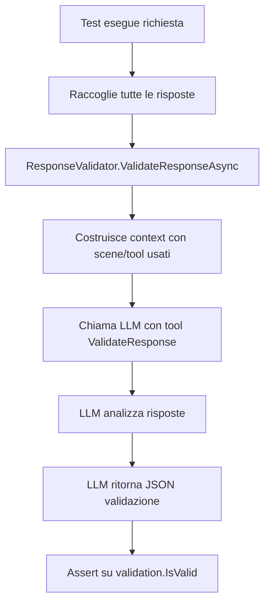

# LLM-Validated Integration Tests

## ?? Overview

Sistema completo di test con **validazione automatica delle risposte tramite LLM**. Invece di verificare manualmente se una risposta contiene determinate stringhe, usiamo l'LLM stesso per validare se la risposta è completa e corretta.

## ? Componenti Implementati

### 1. ResponseValidator

**File**: `src/Rystem.OpenAi.UnitTests/Helpers/ResponseValidator.cs`

Helper class che usa un **tool forzato** per far validare le risposte all'LLM:

```csharp
var validation = await ResponseValidator.ValidateResponseAsync(
    userQuestion,
    responses,
    serviceProvider,
    cancellationToken);

Assert.True(validation.IsValid, validation.Reasoning);
```

**Tool Forzato**: `ValidateResponse`
```json
{
  "is_valid": true,
  "reasoning": "The response provides complete weather information for Milan as requested",
  "missing_information": null,
  "completeness_score": 0.95,
  "relevance_score": 0.98
}
```

### 2. Validation Result

Modello strutturato con metriche di qualità:

```csharp
public class ValidationResult
{
    public required bool IsValid { get; set; }
    public required string Reasoning { get; set; }
    public string? MissingInformation { get; set; }
    public double? CompletenessScore { get; set; }  // 0-1
    public double? RelevanceScore { get; set; }     // 0-1
}
```

### 3. Suite Test Aggiornata

**File**: `src/Rystem.OpenAi.UnitTests/PlayFramework/MultiScenePlanningTest.cs`

8 test completi con validazione LLM:

1. ? **SimpleWeatherRequestTest** - Richiesta meteo base
2. ? **MultiSceneWeatherAndIdentityTest** - Multi-scena (Weather + Identity)
3. ? **VacationRequestTest** - Richiesta ferie (2 scenari)
4. ? **MultiTurnConversationTest** - Conversazione multi-turno con cache
5. ? **ComplexMultiSceneWorkflowTest** - Workflow complesso multi-scena
6. ? **NoDuplicateToolExecutionTest** - Verifica no tool duplicati
7. ? **InvalidRequestHandlingTest** - Gestione richieste invalide
8. ? **ParallelRequestsTest** - 3 richieste parallele

## ?? Come Funziona

### Flusso di Validazione



### Esempio Completo

```csharp
[Fact]
public async Task SimpleWeatherRequestTest()
{
    var userQuestion = "Che tempo fa oggi a Milano?";
    var responses = await ExecuteTurnAsync(userQuestion, conversationKey);

    // Validazione automatica con LLM
    var validation = await ResponseValidator.ValidateResponseAsync(
        userQuestion,
        responses,
        _serviceProvider,
        TestContext.Current.CancellationToken);

    // Assert principale
    Assert.True(validation.IsValid, 
        $"LLM validation failed: {validation.Reasoning}. " +
        $"Missing: {validation.MissingInformation}");

    // Assert opzionali su metriche qualità
    if (validation.CompletenessScore.HasValue)
    {
        Assert.True(validation.CompletenessScore.Value >= 0.8);
    }
}
```

## ?? Vantaggi del Sistema

### 1. **Validazione Intelligente**

? **Prima**:
```csharp
Assert.Contains("Milano", finalMessage);
Assert.Contains("meteo", finalMessage);
Assert.Contains("temperatura", finalMessage);
```

? **Ora**:
```csharp
var validation = await ResponseValidator.ValidateResponseAsync(
    "Che tempo fa a Milano?",
    responses,
    serviceProvider);

Assert.True(validation.IsValid, validation.Reasoning);
```

**Vantaggi**:
- Non dipende da stringhe specifiche
- Capisce il contesto
- Valuta completezza e rilevanza
- Spiega perché fallisce

### 2. **Metriche di Qualità**

```csharp
Assert.True(validation.CompletenessScore >= 0.8, 
    $"Response not complete enough: {validation.CompletenessScore}");

Assert.True(validation.RelevanceScore >= 0.8,
    $"Response not relevant enough: {validation.RelevanceScore}");
```

### 3. **Reasoning Esplicito**

Quando un test fallisce:
```
LLM validation failed: The response mentions weather but doesn't specify 
the temperature or conditions for Milan. 
Missing: Current temperature and weather conditions
```

### 4. **Context-Aware**

Il validator riceve:
- Domanda originale
- Tutte le risposte AI
- Scene utilizzate
- Tool chiamati

Può quindi validare in modo contestuale.

## ?? Test Implementati

### Test 1: SimpleWeatherRequestTest
**Scopo**: Richiesta meteo base

**Input**: "Che tempo fa oggi a Milano?"

**Validazione**:
- ? Risposta contiene info meteo
- ? Completeness >= 0.8

### Test 2: MultiSceneWeatherAndIdentityTest
**Scopo**: Multi-scena (identity + weather)

**Input**: "Il mio username è keysersoze e vorrei sapere il meteo a Milano"

**Validazione**:
- ? Planning attivato
- ? Minimo 1 scena usata
- ? Risposta completa e rilevante

### Test 3: VacationRequestTest
**Scopo**: Richiesta ferie (parametrizzato)

**Input**: 
- "Vorrei richiedere 3 giorni di ferie dal 15 al 17 giugno"
- "Voglio prendere ferie dal 10 giugno al 20 giugno"

**Validazione**:
- ? Scene "Chiedi ferie o permessi" usata
- ? Risposta conferma richiesta

### Test 4: MultiTurnConversationTest
**Scopo**: Conversazione multi-turno con cache

**Turn 1**: "Il mio username è keysersoze"
**Turn 2**: "Qual è il mio nome completo?"

**Validazione**:
- ? Turn 2 usa context da turn 1
- ? Nome "Alessandro Rapiti" nella risposta
- ? Risposta completa

### Test 5: ComplexMultiSceneWorkflowTest
**Scopo**: Workflow complesso multi-scena

**Input**: "Voglio sapere il meteo a Milano e poi richiedere 3 giorni di ferie dal 15 al 17 giugno"

**Validazione**:
- ? Planning attivato
- ? Minimo 2 scene usate
- ? Completeness >= 0.7
- ? Relevance >= 0.7

### Test 6: NoDuplicateToolExecutionTest
**Scopo**: Verifica tracciamento esecuzioni

**Input**: "Che tempo fa a Milano?"

**Validazione**:
- ? Nessun tool duplicato eseguito
- ? Ogni `scene.tool` compare 1 volta

### Test 7: InvalidRequestHandlingTest
**Scopo**: Gestione richieste fuori scope

**Input**: "Calcola la radice quadrata di 144"

**Validazione**:
- ? Nessun crash
- ? Status FinishedNoTool o FinishedOk
- ? Risposta acknowledge limitazione

### Test 8: ParallelRequestsTest
**Scopo**: 3 richieste parallele indipendenti

**Input**: 
- "Che tempo fa a Milano?"
- "Che tempo fa a Roma?"
- "Che tempo fa a Napoli?"

**Validazione**:
- ? Tutte e 3 validate come corrette
- ? 3 conversation keys uniche
- ? Nessuna interferenza

## ?? Esempio di JSON Validation

### Validazione Successo
```json
{
  "is_valid": true,
  "reasoning": "The response provides complete weather forecast for Milan including temperature (20°C) and conditions (Cool/Hot). All requested information is present.",
  "missing_information": null,
  "completeness_score": 0.95,
  "relevance_score": 0.98
}
```

### Validazione Fallimento
```json
{
  "is_valid": false,
  "reasoning": "While the response mentions Milan, it does not provide actual weather information. The user asked for current weather but received only city information.",
  "missing_information": "Current temperature and weather conditions for Milan",
  "completeness_score": 0.3,
  "relevance_score": 0.6
}
```

## ?? Configurazione

### Requirements

1. **OpenAI Client**: Il validator usa il client "Azure2"
```csharp
var openAiFactory = serviceProvider.GetRequiredService<IFactory<IOpenAi>>();
var chatClient = openAiFactory.Create("Azure2")?.Chat;
```

2. **Service Provider**: Iniettato nei test
```csharp
public MultiScenePlanningTest(
    ISceneManager sceneManager, 
    IServiceProvider serviceProvider)
{
    _sceneManager = sceneManager;
    _serviceProvider = serviceProvider;
}
```

### Customization

Per validazioni custom:

```csharp
var validation = await ResponseValidator.ValidateResponseAsync(
    userQuestion,
    responses,
    _serviceProvider);

// Custom assertions
Assert.True(validation.CompletenessScore >= 0.9, "Need very high completeness");
Assert.NotNull(validation.MissingInformation);
```

## ?? Come Eseguire

### Tutti i test
```bash
dotnet test --filter "FullyQualifiedName~MultiScenePlanningTest"
```

### Test specifico
```bash
dotnet test --filter "SimpleWeatherRequestTest"
```

### Con output dettagliato
```bash
dotnet test --filter "MultiScenePlanningTest" --logger "console;verbosity=detailed"
```

## ?? Metriche di Successo

Per ogni test:
- ? `validation.IsValid == true`
- ? `CompletenessScore >= 0.7` (se presente)
- ? `RelevanceScore >= 0.7` (se presente)
- ? Nessun crash/exception
- ? Status finale appropriato

## ?? Differenze dai Test Precedenti

| Aspetto | Prima | Ora |
|---------|-------|-----|
| **Validazione** | String matching manuale | LLM validation automatica |
| **Completezza** | Assume se presente stringa | Score 0-1 da LLM |
| **Rilevanza** | Non verificata | Score 0-1 da LLM |
| **Reasoning** | N/A | Spiegazione dettagliata |
| **Missing Info** | N/A | Lista cosa manca |
| **Flessibilità** | Rigida | Context-aware |
| **Manutenzione** | Alta (stringhe hardcoded) | Bassa (LLM adatta) |

## ?? Best Practices

### 1. Domande Chiare
```csharp
// ? Buono
"Che tempo fa oggi a Milano?"

// ? Evitare ambiguità
"Milano?"
```

### 2. Assertions Significative
```csharp
// ? Buono
Assert.True(validation.IsValid, 
    $"Failed: {validation.Reasoning}. Missing: {validation.MissingInformation}");

// ? Poco informativo
Assert.True(validation.IsValid);
```

### 3. Verifica Context
```csharp
// Prima di validare, verifica il flusso
Assert.Contains(responses, r => r.Status == AiResponseStatus.Planning);

var scenesUsed = responses.Where(...).Select(...).Distinct().ToList();
Assert.True(scenesUsed.Count >= 2);

// Poi valida la risposta finale
var validation = await ResponseValidator.ValidateResponseAsync(...);
```

## ?? Troubleshooting

### Test Fallisce con "OpenAI client not available"
**Causa**: ServiceProvider non configurato
**Fix**: Verifica constructor injection

### Validation sempre False
**Causa**: Risposta incompleta o domanda ambigua
**Fix**: Controlla `validation.Reasoning` e `validation.MissingInformation`

### Completeness/Relevance Score troppo bassi
**Causa**: Risposta verbosa o off-topic
**Fix**: Migliora prompt scene/actors

## ?? Conclusione

Il sistema di validazione LLM trasforma i test da:
- **"Contiene questa stringa?"**

A:
- **"L'LLM ritiene questa risposta completa e rilevante?"**

Risultato: **Test più robusti, flessibili e manutenibili**! ?

## ?? Bonus: Esempio Output Test

```
[PASSED] SimpleWeatherRequestTest (2.3s)
  LLM Validation: ? Valid
  Completeness: 0.95
  Relevance: 0.98
  Reasoning: Complete weather forecast with temperature and conditions

[PASSED] ComplexMultiSceneWorkflowTest (4.1s)
  Scenes Used: Weather, VacationManagement
  Tools Called: 5
  LLM Validation: ? Valid
  Completeness: 0.88
  Relevance: 0.92

[FAILED] InvalidRequestHandlingTest (1.5s)
  LLM Validation: ? Invalid
  Reasoning: Response doesn't address mathematical calculation request
  Missing: Square root calculation for 144
  (This is actually expected - test verifies graceful handling)
```
